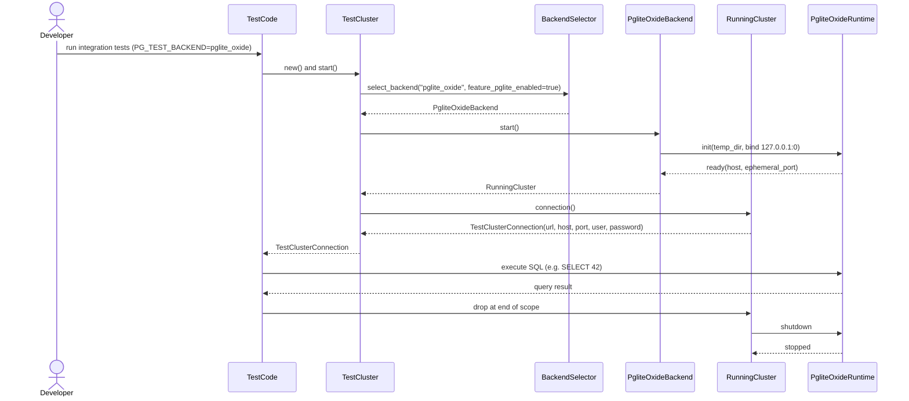
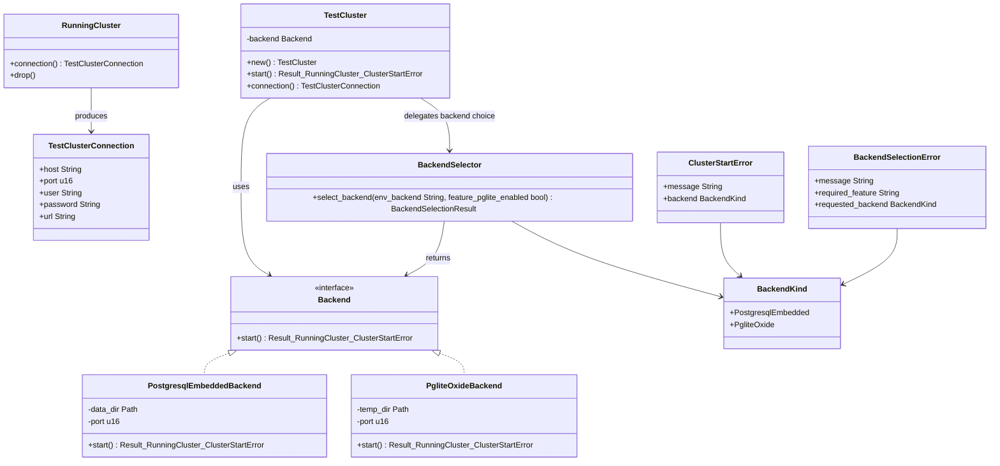

# ADR 001: add pglite-oxide backend alongside postgresql_embedded

- Status: proposed
- Date: 2025-12-12

## Context

This project currently provides a zero-configuration, resource acquisition is
initialisation (RAII) PostgreSQL fixture for tests by orchestrating
`postgresql_embedded` (referred to in some places as the “postgres-embedded”
backend). The fixture is designed to “just work” across root and unprivileged
environments, and to integrate cleanly with `rstest` and `rstest-bdd` as
described in `docs/zero-config-raii-postgres-test-fixture-design.md`.

The `postgresql_embedded` approach provides a high-fidelity PostgreSQL server,
but it has trade-offs that are increasingly relevant for local development and
continuous integration (CI):

- It may require downloading PostgreSQL distributions at runtime (network
  dependency and potential flakiness).
- It may depend on host capabilities (for example, timezone database
  availability) and on filesystem permissions.
- Startup time can be dominated by extraction and initialisation work.

`pglite-oxide` provides an alternative approach: running PostgreSQL via the
PGlite WebAssembly (WASM) runtime and exposing a PostgreSQL wire-protocol proxy
for standard clients.[^pglite-oxide] This has the potential to reduce fixture
startup time, remove runtime download requirements, and improve the developer
experience in restricted or offline environments.

This ADR proposes adding a `pglite-oxide` backend alongside the existing
`postgresql_embedded` backend whilst preserving the project’s core design
principles: zero-configuration defaults, RAII lifecycle management, and clear
escape hatches.

## Goals

- Keep the current `TestCluster` experience (one line to get a working
  PostgreSQL endpoint) and preserve RAII teardown semantics.
- Keep the `postgresql_embedded` backend as the default for fidelity and
  backwards compatibility.
- Add an opt-in `pglite-oxide` backend that can be selected without code
  changes (for example, via an environment variable).
- Preserve “nextest-ready” parallelism expectations from
  `docs/zero-config-raii-postgres-test-fixture-design.md` by ensuring that
  multiple test clusters can exist concurrently without port or directory
  collisions.
- Keep error handling and observability consistent with the existing fixture
  (semantic errors where callers may inspect, `tracing` spans for lifecycle
  steps, and no credential leakage in logs).

## Non-goals

- Replacing or deprecating the `postgresql_embedded` backend.
- Guaranteeing that `pglite-oxide` is a perfect behavioural substitute for a
  native PostgreSQL server.
- Supporting every PostgreSQL extension or OS integration in the `pglite-oxide`
  backend on day one.

## Decision

Introduce a backend abstraction for `TestCluster` and implement a new
`pglite-oxide` backend behind an opt-in Cargo feature.

### Backend contract

Define a small internal contract (trait) that captures what the fixture needs
from “something that behaves like a PostgreSQL cluster”:

- `start() -> Result<RunningCluster, ClusterStartError>`
- `connection() -> TestClusterConnection` (host, port, user, password, and a
  rendered `postgresql://` URL)
- RAII stop-on-drop semantics for `RunningCluster`
- Per-cluster isolation (unique runtime/data directories and an ephemeral port)

This contract should be internal to the crate (not a public plugin API). The
user-facing API remains `TestCluster` and `TestClusterConnection`.

### Backend selection model

Keep selection simple and zero-config by default:

- Default backend: `postgresql_embedded`.
- Opt-in backend: `pglite-oxide`, enabled via a Cargo feature and activated at
  runtime via a single environment variable (for example `PG_TEST_BACKEND`).

Expected `PG_TEST_BACKEND` values:

- `postgresql_embedded` (default when unset)
- `pglite_oxide` (requires a feature-gated `pglite-oxide` backend build)

When the env var selects a backend that is not compiled in, the fixture should
fail with a clear error that describes the required Cargo feature.

This matches the existing design approach: defaults that “just work” plus
escape hatches for unusual environments.

The fixture should render connection strings using the `postgresql://` scheme.
This keeps the output aligned with existing `postgresql_embedded` connection
helpers and avoids downstream ambiguity between `postgres://` and
`postgresql://`.

Example error when a non-compiled backend is selected:

```plaintext
SKIP-TEST-CLUSTER: requested backend "pglite_oxide" is not available; enable Cargo feature "pglite-oxide"
```

### Backend selection and lifecycle (pglite-oxide)

For screen readers: The following sequence diagram shows an integration test
run selecting the `pglite-oxide` backend via `PG_TEST_BACKEND`, starting a
cluster bound to `127.0.0.1` on an ephemeral port, executing SQL, and then
stopping the runtime automatically when the RAII guard is dropped.



### Backend abstraction overview

For screen readers: The following class diagram shows `TestCluster` delegating
to a selected backend. Both `PostgresqlEmbeddedBackend` and
`PgliteOxideBackend` implement a shared backend interface, and both produce a
`RunningCluster` which can render a `TestClusterConnection`.



## Design notes

### Existing backend: postgresql_embedded

No change in behaviour is intended for the default backend. The work in
`docs/zero-config-raii-postgres-test-fixture-design.md` remains the source of
truth for:

- Root vs unprivileged execution detection.
- Environment scoping and restoration (`ScopedEnv`).
- Ephemeral ports and per-test data directories.
- Observability (sanitised settings snapshots and lifecycle spans).

The backend abstraction should wrap the existing implementation rather than
re-implementing it.

### New backend: pglite-oxide

The `pglite-oxide` backend should aim to satisfy the same “looks like Postgres”
properties from the perspective of integration tests:

- Standard clients can connect using `postgresql://…` connection strings.
- Multiple clusters can be created concurrently by tests.
- Cluster teardown happens automatically on drop.

To align with the RAII fixture design, the implementation should:

- Allocate a per-cluster temporary directory and store all runtime state
  beneath it.
- Bind the proxy on `127.0.0.1` using an ephemeral port (rather than a fixed
  `5432`).
- Avoid process-global paths (such as a shared `/tmp` socket file) that could
  collide under parallel test execution.

#### Upstream API considerations

At the time of writing, `pglite-oxide`’s convenience helpers are oriented
towards fixed default paths and ports. To preserve this project’s parallel test
expectations, the plan should be to either:

- Contribute upstream changes to support custom mount paths and listener
  binding (preferred), or
- Treat the `pglite-oxide` backend as experimental and serialise access behind
  a process-global lock until upstream exposes the necessary controls
  (acceptable only as an explicitly documented transitional state).

The preferred direction is upstream collaboration, so this project does not
carry a long-lived fork and so the ecosystem benefits from the improvements.

### Observability and error handling

Both backends should emit the same high-level lifecycle spans (start, ready,
stop) under a consistent `tracing` target, with backend-specific details
captured as structured fields. Errors should remain semantic and actionable:

- Configuration/selection errors should explain how to switch backends or how
  to enable the required Cargo feature.
- Runtime failures should include enough context to diagnose the underlying
  issue (for example, listener bind failures or filesystem path issues).

Logs must not leak secrets; where credentials exist, only record that a value
was set or unset, mirroring the current design.

## Consequences

### Benefits

- Faster “time to first query” for many test suites, especially when the
  `postgresql_embedded` backend would otherwise download or extract binaries.
- A viable path for running tests in offline or restricted-network
  environments.
- Reduced coupling to host PostgreSQL prerequisites (for example, fewer
  failure modes related to the time zone database).

### Costs and risks

- Additional dependencies and compilation time when the `pglite-oxide` feature
  is enabled.
- Behavioural differences between a WASM-based PostgreSQL runtime and a native
  server may surface in edge cases (extensions, filesystem features, system
  catalog details, and performance characteristics).
- If upstream does not support per-cluster isolation primitives, parallel test
  support will require either upstream work or a clearly documented limitation
  for the `pglite-oxide` backend.

## Alternatives considered

- Keep only the `postgresql_embedded` backend and improve caching and download
  robustness.
- Require an external PostgreSQL dependency (Docker, system service, or CI
  service container). This conflicts with the project’s zero-config ethos and
  makes local development less predictable.
- Use a non-PostgreSQL database for tests. This undermines the fixture’s goal
  of exercising PostgreSQL behaviour end-to-end.

## Implementation plan

1. Introduce an internal backend abstraction and refactor the existing
   `TestCluster` implementation to delegate to a `postgresql_embedded` backend
   adapter with no behavioural changes.
2. Add a feature-gated `pglite-oxide` backend implementation that:
   - Uses a per-cluster temporary directory for runtime state.
   - Binds to `127.0.0.1` on an ephemeral port.
   - Produces a `postgresql://` URL compatible with current callers (including
     the optional Diesel helper).
3. Add a small compatibility test suite that validates both backends with
   minimal SQL (for example `SELECT 42`) and asserts teardown behaviour.
4. Document backend selection, limitations, and troubleshooting guidance in the
   user documentation.
5. If required, upstream or vendor the minimal changes needed in `pglite-oxide`
   to support custom mount paths and listener binding.

## Open questions

- What is the minimum supported `pglite-oxide` version that provides the
  capabilities needed for per-cluster isolation?
- Which PostgreSQL features and extensions are in-scope for the `pglite-oxide`
  backend, and which should be documented as unsupported?
- How should the fixture behave when the selected backend cannot run on the
  current platform (hard error vs soft skip)?

## References

- `pglite-oxide` crate.[^pglite-oxide]
- Zero-config fixture design:
  `docs/zero-config-raii-postgres-test-fixture-design.md`.
- Documentation conventions: `docs/documentation-style-guide.md`.

[^pglite-oxide]: `pglite-oxide` on crates.io:
                 <https://crates.io/crates/pglite-oxide>.
