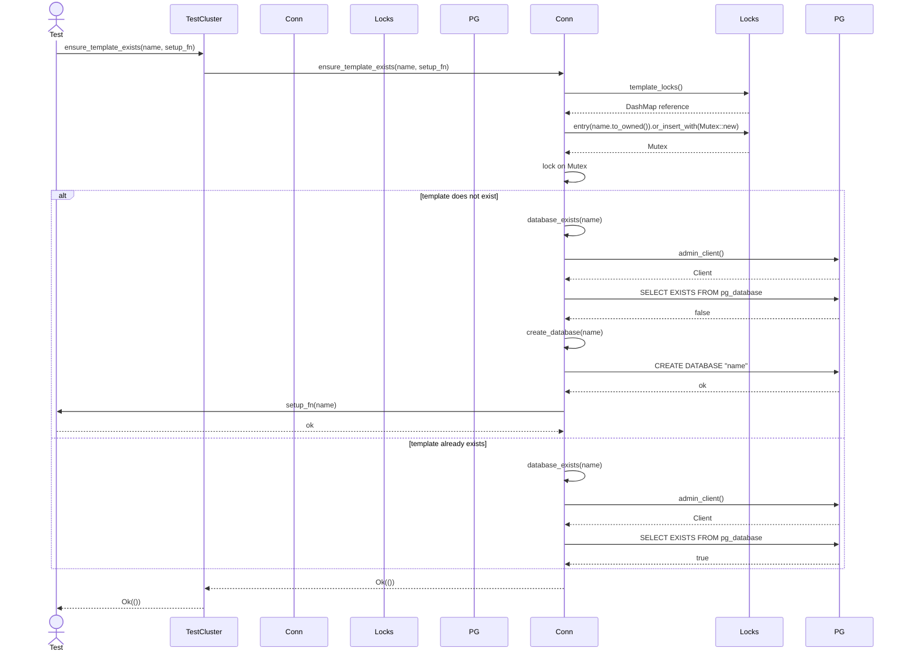

# ADR 002: template database support for fast test isolation

## Status

Accepted. Phase 1 (core database lifecycle API) complete. Phase 2 (shared
cluster fixture) complete. Phase 3 (template creation with concurrency safety)
complete. Phase 4 (documentation) complete. Phase 5 (cleanup automation)
complete.

## Date

2025-12-26.

## Context and problem statement

Integration tests that exercise PostgreSQL-backed repositories currently pay
the full cluster bootstrap cost (download, `initdb`, and `postmaster` startup)
plus schema migration for every test function. In real-world projects using
`pg_embedded_setup_unpriv`, this manifests as 20–30 second test runtimes per
function:

```plaintext
PASS [  21.604s] backend::diesel_user_repository diesel_upsert_updates_existing_user
PASS [  28.748s] backend::diesel_user_repository diesel_user_repository_round_trip
```

The root cause is the per-test fixture model: each `#[rstest]` function
receives a fresh `TestCluster`, which bootstraps an entire PostgreSQL instance
and then applies migrations before the test body executes. For a module with
ten tests, the cumulative overhead can exceed four minutes even when individual
queries complete in milliseconds.

PostgreSQL's `CREATE DATABASE … TEMPLATE` mechanism provides a well-established
solution: create one "template" database with the desired schema applied, then
clone it for each test. Cloning is a filesystem-level copy operation that
completes in milliseconds, regardless of schema complexity.

This ADR proposes extending `TestCluster` to support shared cluster lifecycles
and template-based database creation, enabling consumers to reduce per-test
overhead from seconds to milliseconds.

## Decision drivers

- **Test execution time:** Cumulative bootstrap and migration overhead
  dominates wall-clock time for repository integration tests.
- **Test isolation:** Each test must operate on an independent database to
  prevent cross-test contamination.
- **Ergonomics:** The solution should integrate naturally with `rstest` fixtures
  and require minimal boilerplate in consuming projects.
- **Backwards compatibility:** Existing consumers using per-test `TestCluster`
  must continue to work without modification.
- **Parallel execution:** The solution must remain compatible with `nextest` and
  `cargo test` parallel execution models.

## Requirements

### Functional requirements

1. **Shared cluster lifetime:** Allow a single `TestCluster` instance to be
   shared across multiple tests within a module or test binary.
2. **Database creation:** Expose a method to create new databases on a running
   cluster.
3. **Template cloning:** Expose a method to create a database by cloning an
   existing template database.
4. **Database cleanup:** Optionally support dropping databases after test
   completion to reclaim resources.

### Technical requirements

1. **Thread safety:** Shared cluster access must be safe across test threads.
2. **Unique naming:** Database names must be unique within a cluster to prevent
   collisions under parallel execution.
3. **Privilege awareness:** Database creation must respect the existing
   `ExecutionPrivileges` model (root vs unprivileged paths).
4. **Observability:** Database lifecycle events (create, clone, drop) must emit
   tracing spans consistent with existing cluster lifecycle instrumentation.

## Options considered

### Option A: SQL-based database creation via existing connection

Expose helper methods on `TestClusterConnection` that execute `CREATE DATABASE`
and `DROP DATABASE` statements via an existing superuser connection to the
`postgres` database.

```rust,no_run
impl TestClusterConnection {
    /// Creates a new empty database.
    pub fn create_database(&self, name: &str) -> BootstrapResult<()>;

    /// Creates a new database by cloning an existing template.
    pub fn create_database_from_template(
        &self,
        name: &str,
        template: &str,
    ) -> BootstrapResult<()>;

    /// Drops a database.
    pub fn drop_database(&self, name: &str) -> BootstrapResult<()>;
}
```

Advantages:

- Minimal new dependencies (requires only SQL execution capability).
- Works with both `postgresql_embedded` and future `pglite-oxide` backends.
- Straightforward implementation using Diesel or raw `libpq` calls.

Disadvantages:

- Requires an active connection to the cluster, adding a runtime dependency on
  `diesel` or similar.
- Template creation (applying migrations) remains the caller's responsibility.

### Option B: delegate to postgresql_embedded::PostgreSQL::create_database

Wrap the existing `postgresql_embedded::PostgreSQL::create_database()` method
and expose it through `TestCluster`.

```rust,no_run
impl TestCluster {
    /// Creates a new empty database using the underlying postgresql_embedded API.
    pub fn create_database(&self, name: &str) -> BootstrapResult<()>;
}
```

Advantages:

- Reuses existing upstream functionality.
- No additional connection management required.

Disadvantages:

- `postgresql_embedded::PostgreSQL::create_database()` does not support the
  `TEMPLATE` clause; it creates empty databases only.
- Couples the API to `postgresql_embedded`, complicating the backend abstraction
  introduced in ADR 001.

### Option C: fixture-level template pattern (documentation-only)

Document a recommended pattern for consumers to implement template-based
testing using `#[once]` fixtures and raw SQL, without adding new API surface to
the crate.

```rust,no_run
use std::sync::OnceLock;
use rstest::fixture;

static SHARED_CLUSTER: OnceLock<TestCluster> = OnceLock::new();

#[fixture]
#[once]
fn shared_cluster() -> &'static TestCluster {
    SHARED_CLUSTER.get_or_init(|| TestCluster::new().expect("cluster bootstrap"))
}

#[fixture]
#[once]
fn template_database(shared_cluster: &TestCluster) -> &'static str {
    const TEMPLATE_NAME: &str = "test_template";
    // Create template and apply migrations (caller's responsibility)
    TEMPLATE_NAME
}

#[fixture]
fn test_database(
    shared_cluster: &TestCluster,
    template_database: &str,
) -> String {
    let db_name = format!("test_{}", uuid::Uuid::new_v4());
    // Clone from template (caller's responsibility)
    db_name
}
```

Advantages:

- No API changes required in the crate.
- Demonstrates flexibility of existing primitives.

Disadvantages:

- Significant boilerplate in consuming projects.
- Error handling and cleanup become the caller's responsibility.
- No observability or privilege-awareness for database lifecycle operations.

| Aspect           | Option A (SQL helpers) | Option B (postgresql_embedded) | Option C (documentation) |
| ---------------- | ---------------------- | ------------------------------ | ------------------------ |
| Template support | Yes                    | No                             | Yes (manual)             |
| Backend agnostic | Yes                    | No                             | Yes                      |
| Boilerplate      | Low                    | Low                            | High                     |
| Observability    | Integrated             | Partial                        | Manual                   |
| Privilege aware  | Yes                    | Inherited                      | Manual                   |
| New dependencies | Diesel or libpq        | None                           | None                     |

_Table 1: Comparison of options for template database support._

## Decision outcome / proposed direction

**Option A (SQL-based database creation)** is the recommended direction, with
Option C's fixture pattern documented as a migration path for consumers who
cannot immediately upgrade.

Option A provides the best balance of ergonomics, backend independence, and
observability. The SQL-based approach works uniformly across
`postgresql_embedded` and future `pglite-oxide` backends, and integrates
naturally with the existing privilege-aware execution model.

The implementation should:

1. Add `create_database`, `create_database_from_template`, and `drop_database`
   methods to `TestClusterConnection`, with delegation methods on `TestCluster`
   for ergonomics.
2. Use the `postgres` crate for DDL execution rather than requiring
   `diesel-support`, keeping dependencies minimal and decoupling from async
   Diesel machinery.
3. Emit tracing spans for database lifecycle events.
4. Provide a built-in `shared_cluster()` function and `rstest` fixture for
   shared cluster access.
5. Document the recommended fixture pattern for template databases.

## Goals and non-goals

### Goals

- Reduce per-test overhead from seconds to milliseconds for schema-heavy
  integration tests.
- Provide ergonomic helpers that integrate with `rstest` fixture patterns.
- Maintain backwards compatibility with existing per-test `TestCluster` usage.
- Support both privileged and unprivileged execution paths.

### Non-goals

- Automatic migration management (consumers remain responsible for applying
  migrations to template databases).
- Database pooling or connection multiplexing.
- Support for databases other than PostgreSQL.

## Migration plan

### Phase 1: Core database lifecycle API

Add the following methods to `TestClusterConnection`:

- `create_database(name: &str) -> BootstrapResult<()>`
- `create_database_from_template(name: &str, template: &str) -> BootstrapResult<()>`
- `drop_database(name: &str) -> BootstrapResult<()>`
- `database_exists(name: &str) -> BootstrapResult<bool>`

Implementation via SQL statements executed against the `postgres` database
using the `postgres` crate (sync):

```rust,no_run
use postgres::{Client, NoTls};

fn create_database(&self, name: &str) -> BootstrapResult<()> {
    let mut client = Client::connect(&self.admin_url(), NoTls)?;
    client.batch_execute(&format!("CREATE DATABASE \"{name}\""))?;
    Ok(())
}
```

Add delegation methods on `TestCluster` for ergonomics:

```rust,no_run
impl TestCluster {
    pub fn create_database(&self, name: &str) -> BootstrapResult<()> {
        self.connection().create_database(name)
    }
}
```

### Phase 2: Shared cluster fixture support

Add a built-in `shared_cluster()` function backed by `OnceLock`:

```rust,no_run
/// Returns a reference to the shared test cluster.
///
/// The cluster is initialised lazily on first access. Subsequent calls
/// return the same cluster instance.
pub fn shared_cluster() -> BootstrapResult<&'static TestCluster> {
    static CLUSTER: OnceLock<TestCluster> = OnceLock::new();
    CLUSTER.get_or_try_init(TestCluster::new)
}

// rstest fixture wrapper
#[fixture]
pub fn shared_test_cluster() -> &'static TestCluster {
    shared_cluster().expect("shared cluster bootstrap")
}
```

This reduces boilerplate for consumers and provides a single audited
implementation.

### Phase 3: Template creation with concurrency safety

Add an `ensure_template_exists` helper to prevent concurrent template creation:

```rust,no_run
use dashmap::DashMap;
use std::sync::{Mutex, OnceLock};

static TEMPLATE_LOCKS: OnceLock<DashMap<String, Mutex<()>>> = OnceLock::new();

/// Ensures a template database exists, creating it if necessary.
///
/// Uses a per-template lock to prevent concurrent creation attempts.
/// The `setup_fn` is called only if the template does not exist.
pub fn ensure_template_exists<F>(
    &self,
    name: &str,
    setup_fn: F,
) -> BootstrapResult<()>
where
    F: FnOnce(&str) -> BootstrapResult<()>,
{
    let locks = TEMPLATE_LOCKS.get_or_init(DashMap::new);
    let lock = locks
        .entry(name.to_owned())
        .or_insert_with(|| Mutex::new(()));
    let _guard = lock.lock().unwrap_or_else(|e| e.into_inner());

    if !self.database_exists(name)? {
        self.create_database(name)?;
        setup_fn(name)?;
    }
    Ok(())
}
```

The following diagram illustrates the concurrency-safe template creation flow:



### Phase 4: Documentation and examples

Update the user guide and README with:

- A complete example of the template database pattern.
- Performance comparison (per-test cluster vs shared cluster with templates).
- Guidance on template naming strategies (including migration version
  identifiers).
- Guidance on cleanup strategies (explicit `drop_database` vs letting the
  cluster teardown handle it).

### Phase 5: Optional cleanup automation

Add a `TemporaryDatabase` RAII guard that drops the database on `Drop`,
mirroring the `TestCluster` lifecycle semantics. The struct stores connection
metadata (URL) rather than a borrowed connection to avoid lifetime issues:

```rust,no_run
pub struct TemporaryDatabase {
    name: String,
    admin_url: String,
}

impl TemporaryDatabase {
    /// Drops the database, failing if connections exist.
    pub fn drop(self) -> BootstrapResult<()> {
        self.try_drop()
    }

    /// Drops the database, terminating any active connections first.
    pub fn force_drop(self) -> BootstrapResult<()> {
        let mut client = Client::connect(&self.admin_url, NoTls)?;
        // Terminate active connections using a parameterized query
        client.execute(
            concat!(
                "SELECT pg_terminate_backend(pid) ",
                "FROM pg_stat_activity ",
                "WHERE datname = $1 AND pid <> pg_backend_pid()"
            ),
            &[&self.name],
        )?;
        client.batch_execute(&format!("DROP DATABASE \"{}\"", self.name))?;
        Ok(())
    }

    fn try_drop(&self) -> BootstrapResult<()> {
        let mut client = Client::connect(&self.admin_url, NoTls)?;
        client.batch_execute(&format!("DROP DATABASE \"{}\"", self.name))?;
        Ok(())
    }
}

impl Drop for TemporaryDatabase {
    fn drop(&mut self) {
        // Best-effort drop, log warning on failure
        if let Err(e) = self.try_drop() {
            tracing::warn!(
                db = %self.name,
                error = ?e,
                "failed to drop temporary database"
            );
        }
    }
}
```

Factory methods on `TestClusterConnection`:

```rust,no_run
impl TestClusterConnection {
    /// Creates a temporary database that is dropped when the guard is dropped.
    pub fn temporary_database(&self, name: &str) -> BootstrapResult<TemporaryDatabase>;

    /// Creates a temporary database from a template.
    pub fn temporary_database_from_template(
        &self,
        name: &str,
        template: &str,
    ) -> BootstrapResult<TemporaryDatabase>;
}
```

## Known risks and limitations

- **Connection requirement:** Database creation requires an active connection to
  the cluster. If the cluster is managed via the worker subprocess (root path),
  SQL execution must be delegated appropriately.
- **Template invalidation:** If migrations change between test runs, stale
  template databases may cause spurious failures. Consumers should include
  migration version identifiers in template names or drop templates between
  runs.
- **Cleanup ordering:** If a template database has active connections from
  cloned databases, dropping the template will fail. The recommended pattern is
  to drop cloned databases before the shared cluster tears down.
- **Concurrent template creation:** Multiple tests might try to create the same
  template database simultaneously. The `ensure_template_exists` helper (Phase
  3) addresses this with per-template locking.
- **New dependency:** The `postgres` crate is added as a dependency for DDL
  execution. This is lighter than requiring `diesel-support` and keeps the
  feature decoupled from async machinery.

## Design decisions

The following design decisions were made during review of this ADR:

| Decision              | Resolution                                                 |
| --------------------- | ---------------------------------------------------------- |
| Built-in fixture      | Yes, provide `shared_cluster()` function + rstest fixture  |
| Template naming       | Accept user-provided name, document versioning strategies  |
| Drop with connections | Fail by default, provide `force_drop` option               |
| Feature gating        | Use `postgres` crate instead of requiring `diesel-support` |
| Convenience methods   | Add delegation methods on `TestCluster`                    |
| Ownership model       | Store connection URL, not borrowed connection              |
| Concurrent creation   | Add `ensure_template_exists` with per-template locking     |

_Table 2: Summary of design decisions._

### Built-in shared cluster fixture

Provide a built-in `shared_cluster()` function rather than documenting the
`OnceLock` pattern for consumers to implement. This reduces boilerplate and
provides a single audited implementation, consistent with the crate's approach
to handling process-global state safely.

### Template naming strategy

Accept a user-provided template name rather than generating one automatically.
Consumers handle versioning in the template name:

```rust,no_run
let template_name = format!("template_v{}", SCHEMA_VERSION);
// or
let template_name = format!("template_{}", migrations_hash());
```

This keeps the crate simple while giving consumers flexibility. Options
considered included:

- Hash of migrations directory: Automatic but slow for large migration sets.
- User-provided version string: Control but requires manual updates.
- Timestamp: Simple but does not track actual schema changes.

### Drop behaviour with active connections

The `TemporaryDatabase::drop()` method fails by default if connections exist,
mirroring PostgreSQL's native behaviour. A `force_drop()` method provides an
escape hatch that terminates active connections before dropping.

### Feature gating

Use the `postgres` crate (sync) for DDL statements instead of requiring
`diesel-support`. This:

- Decouples the template feature from async Diesel machinery.
- Allows the feature to work without enabling `diesel-support`.
- Keeps dependencies minimal.

### TemporaryDatabase ownership model

Store the database name and connection URL rather than a borrowed
`TestClusterConnection`. This avoids lifetime issues and allows the guard to
reconnect in `Drop` if needed.

## Architectural rationale

This proposal aligns with the project's core design principles:

- **Zero-configuration defaults:** Existing per-test `TestCluster` usage
  continues to work unchanged. Template support is opt-in.
- **RAII lifecycle management:** The optional `TemporaryDatabase` guard mirrors
  the `TestCluster` pattern, ensuring cleanup without explicit teardown calls.
- **Clear escape hatches:** Consumers can use the low-level `create_database`
  and `drop_database` methods directly when the RAII pattern does not fit their
  needs.
- **Observability:** Database lifecycle events integrate with the existing
  tracing infrastructure.

## References

- Zero-config fixture design:
  `docs/zero-config-raii-postgres-test-fixture-design.md`.
- Backend abstraction proposal: `docs/adr-001-pglite-oxide-backend.md`.
- PostgreSQL `CREATE DATABASE` documentation:
  <https://www.postgresql.org/docs/current/sql-createdatabase.html>.
