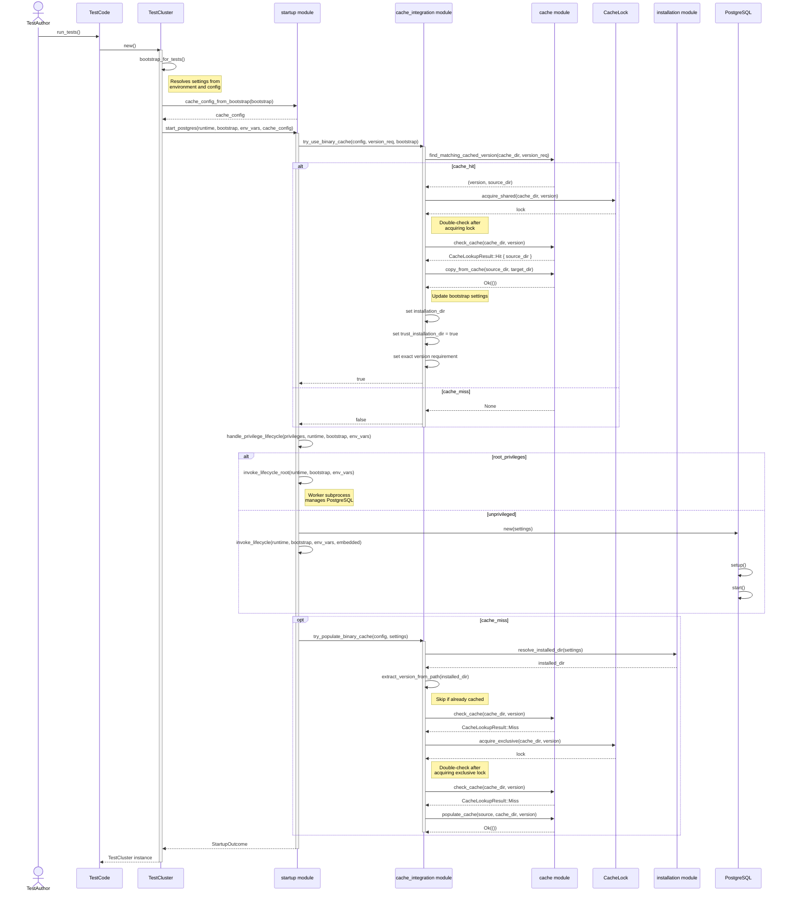

# Shared binary cache

The `pg_embedded_setup_unpriv` crate provides a shared binary cache that stores
PostgreSQL binaries across test runs. When `TestCluster` creates a cluster, it
first checks the cache for a matching version. If binaries are found, they are
copied to the installation directory, avoiding the download cost. After a
successful download, the cache is populated so subsequent runs benefit.

## Cache location

The cache directory is resolved using the following priority:

1. `PG_BINARY_CACHE_DIR` environment variable (when set and non-empty)
2. `$XDG_CACHE_HOME/pg-embedded/binaries` (when `XDG_CACHE_HOME` is set)
3. `~/.cache/pg-embedded/binaries` (home directory fallback)
4. `/tmp/pg-embedded/binaries` (last resort when none of the above are
   available)

The `/tmp` fallback ensures the cache functions in restricted environments such
as CI containers where the home directory may be inaccessible.

## Cache structure

```plaintext
{cache_dir}/
  .locks/
    17.4.0.lock
    16.3.0.lock
  17.4.0/
    .complete
    bin/
      postgres
      pg_ctl
      ...
    lib/
      ...
    share/
      ...
  16.3.0/
    .complete
    bin/
    lib/
    share/
```

- **`.locks/`**: Contains per-version lock files for cross-process coordination.
- **`{version}/`**: Version-specific directories holding extracted binaries.
- **`.complete`**: Marker file indicating a valid, complete cache entry.

A cache entry is valid when both the `.complete` marker and the `bin/`
subdirectory exist. Incomplete entries (missing marker or binaries) are ignored
during cache lookups.

## Version matching

The cache supports semver version requirements. When `TestCluster` requests
`^17`, the cache scans for directories whose names parse as valid semver
versions matching the requirement. The highest matching version is selected.

For example, with cached versions `17.2.0` and `17.4.0`, a requirement of `^17`
matches `17.4.0`.

## Cross-process coordination

The cache uses file-based advisory locking (`flock(2)` on Unix) to coordinate
concurrent access:

- **Shared locks**: Acquired when reading from the cache. Multiple readers can
  access the same version concurrently.
- **Exclusive locks**: Acquired when downloading or populating the cache,
  preventing concurrent writes.

Locks are per-version, allowing different versions to be downloaded in parallel
without contention.

On non-Unix platforms, locking is not supported; concurrent tests may race.

## Integration with TestCluster

`TestCluster` integrates with the cache transparently:

1. Before setup, the cluster checks the cache for a matching version.
2. On cache hit, binaries are copied to the installation directory and
   `trust_installation_dir` is set to skip re-validation.
3. On cache miss, binaries are downloaded normally.
4. After a successful download, the cluster populates the cache for future use.

Cache operations are best-effort: failures log warnings and fall back to normal
downloads without blocking test execution.

## Environment variables

Table: Environment variables used by the binary cache.

| Variable              | Description                           |
| --------------------- | ------------------------------------- |
| `PG_BINARY_CACHE_DIR` | Override the cache directory location |
| `XDG_CACHE_HOME`      | Standard XDG cache base directory     |

## Startup sequence

Figure: `TestCluster` startup with binary cache integration.



## Cache maintenance

The cache does not perform automatic cleanup. To clear stale entries:

```bash
rm -rf ~/.cache/pg-embedded/binaries
```

Or remove specific versions:

```bash
rm -rf ~/.cache/pg-embedded/binaries/16.3.0
```

Lock files in `.locks/` may be safely deleted when no processes are actively
using the cache.
