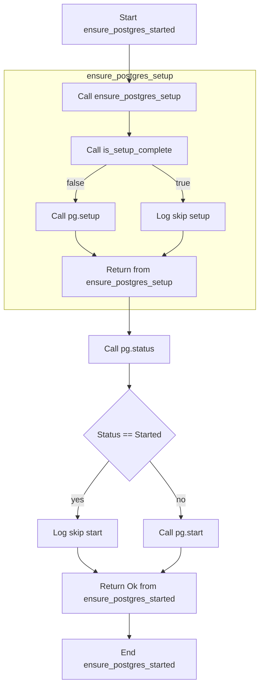

# Issue 60.5: Lifecycle Behavior Helpers

## Overview

Implement idempotent lifecycle state management helpers in
`tests/support/pg_worker.rs` to prevent redundant operations and ensure proper
setup/start ordering.

## Background

The `pg_worker` binary currently performs setup/start operations without
checking if they've already been completed. This can lead to:

- Redundant `setup()` calls that fail on existing data directories
- Redundant `start()` calls that may fail or be unnecessary
- No guarantee that `start()` only occurs after successful `setup()`

The `postgresql_embedded` crate provides a `Status` enum:

- `NotInstalled`: Archive not installed
- `Installed`: Installation complete; not initialized
- `Started`: Server started
- `Stopped`: Server initialized and stopped

## Requirements

### 1. Helper Functions

#### `is_setup_complete(pg: &PostgreSQL, data_dir: &Utf8Path) -> bool`

**Purpose**: Check if PostgreSQL setup is complete (both installed and
initialized).

**Implementation**:

- Check if the data directory is a directory and contains `PG_VERSION`
- Check if `pg.status()` indicates installation is complete (not
  `NotInstalled`)
- Return `true` only if data directory is valid and installation exists

**Rationale**:

- `PG_VERSION` is a canonical marker for a PostgreSQL data directory
- Created during `pg.setup()` and persists through start/stop cycles
- This aligns with PostgreSQL's own data directory validation
- Must also check installation status to avoid skipping setup when binaries are
  missing

#### `ensure_postgres_setup(pg: &mut PostgreSQL, data_dir: &Utf8Path)

-> Result<(), BoxError>`

**Purpose**: Ensure PostgreSQL is set up, performing setup only if necessary.

**Implementation**:

- Call `is_setup_complete()` to check if setup is needed
- If not complete:
  - Call `pg.setup().await` to initialize the data directory
  - Return any errors with descriptive context
- If already complete:
  - Log that setup is being skipped (using `tracing::info!`)
  - Return `Ok(())` immediately

**Error handling**:

- Map `postgresql_embedded::Error` to `WorkerError::PostgresOperation`
- Preserve error context (e.g., "setup failed: {original_error}")

#### `ensure_postgres_started(pg: &mut PostgreSQL, data_dir: &Utf8Path)

-> Result<(), BoxError>`

**Purpose**: Ensure PostgreSQL is started, with proper setup ordering.

**Implementation**:

- First call `ensure_postgres_setup()` to guarantee setup is complete
- Check current status using `pg.status()`
- If `Status::Started`:
  - Log that start is being skipped
  - Return `Ok(())` immediately
- If not started:
  - Call `pg.start().await`
  - Handle `AlreadyStarted` errors gracefully if they occur
  - Return any errors with descriptive context

**Status checking**:

- Use `pg.status()` to query current state
- Check if status equals `postgresql_embedded::Status::Started`

**Error handling**:

- Map `postgresql_embedded::Error` to `WorkerError::PostgresOperation`
- Preserve error context (e.g., "start failed: {original_error}")

### 2. Operation Handling Updates

Update `run_worker()` operation dispatch:

#### `Operation::Setup`

- Replace current `execute_setup(pg_handle)` call with
  `ensure_postgres_setup(pg_handle, &data_dir)`
- Pass `&data_dir` extracted from settings

#### `Operation::Start`

- Replace current `execute_start(&mut pg)` call with
  `ensure_postgres_started(pg, &data_dir)`
- Pass `&data_dir` extracted from settings
- Maintain existing `std::mem::forget(handle)` pattern after successful start

#### `Operation::Stop`

- No changes required
- Already idempotent via `handle_stop_result()` which ignores missing
  `postmaster.pid` errors

### 3. Data Directory Extraction

Add helper to extract data directory from settings:

```rust
fn extract_data_dir(settings: &postgresql_embedded::Settings) -> Utf8PathBuf {
    Utf8PathBuf::from_path_buf(settings.data_dir.clone())
        .expect("data_dir must be valid UTF-8")
}
```

**Rationale**:

- Settings uses `std::path::PathBuf` but our helpers use `Utf8Path`
- Centralizes the conversion logic
- Fails fast with clear error if data_dir is not valid UTF-8

### 4. Imports

Add necessary imports:

```rust
use camino::Utf8Path;
use tracing::info;
```

**Rationale**:

- `Utf8Path` for UTF-8 validated paths
- `tracing::info` for idempotent operation logging

### 5. Flow Diagram



**Figure:** Lifecycle flow for `ensure_postgres_started` showing setup
validation and idempotent start logic.

## Implementation Order

1. Add imports (`Utf8Path`, `tracing::info`)
2. Implement `is_setup_complete()` helper
3. Implement `ensure_postgres_setup()` helper
4. Implement `ensure_postgres_started()` helper
5. Add `extract_data_dir()` helper
6. Update `run_worker()` to extract data_dir and pass to helpers
7. Update operation dispatch to use new helpers

## Testing Considerations

### Existing tests remain valid

- `start_operation_does_not_stop_postgres` test will still pass
- Setup/start operations remain functionally equivalent, just more idempotent

### New test scenarios to consider (future)

- Calling `setup` twice should succeed (idempotent)
- Calling `start` twice should succeed (idempotent)
- Calling `start` without prior `setup` should succeed (helper ensures setup)

## Error Messages

Error messages should follow existing pattern:

```rust
WorkerError::PostgresOperation(format!("setup failed: {e}"))
WorkerError::PostgresOperation(format!("start failed: {e}"))
```

Log messages for idempotent operations:

```rust
info!("PostgreSQL setup already complete, skipping redundant setup");
info!("PostgreSQL already started, skipping redundant start");
```

## Dependencies

### External crates (already available)

- `camino` for `Utf8Path`/`Utf8PathBuf`
- `postgresql_embedded` for `Status` enum
- `tracing` for logging
- `thiserror` for error handling

### Internal patterns (already available)

- `std::path::Path` for path operations

## Open Questions

1. **Should we check for `postmaster.pid` in `is_setup_complete`?**
    - Only `PG_VERSION` needed to detect initialized data dir.
    - `postmaster.pid` indicates running state (not validity).

2. **Log level for idempotent skips?**
    - `info` level as currently planned.
    - Alternative: `debug` level to reduce noise.

## Notes

- The `postgresql_embedded::setup()` method already checks if data directory
  exists and skips initialization if present
- However, `is_setup_complete()` is still needed to detect partial/corrupted
  setups and to ensure installation is complete before skipping setup
- The `Status::Stopped` variant indicates data dir is initialized but server
  not running
- This implementation ensures robust state management across all operation
  sequences
