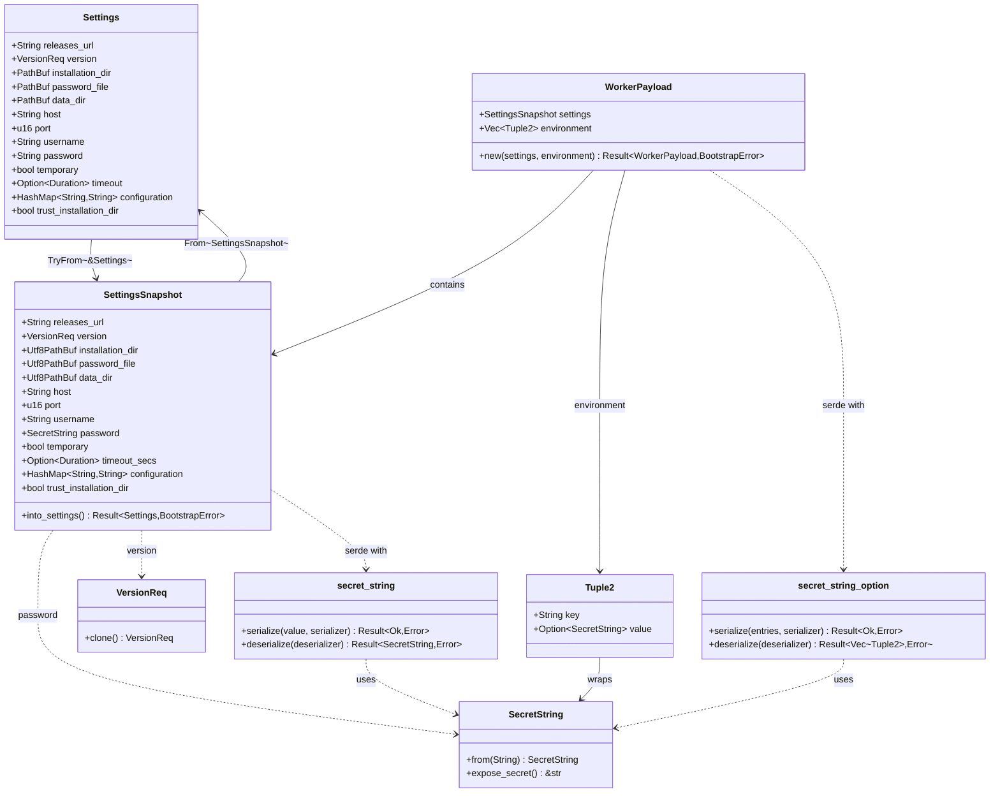
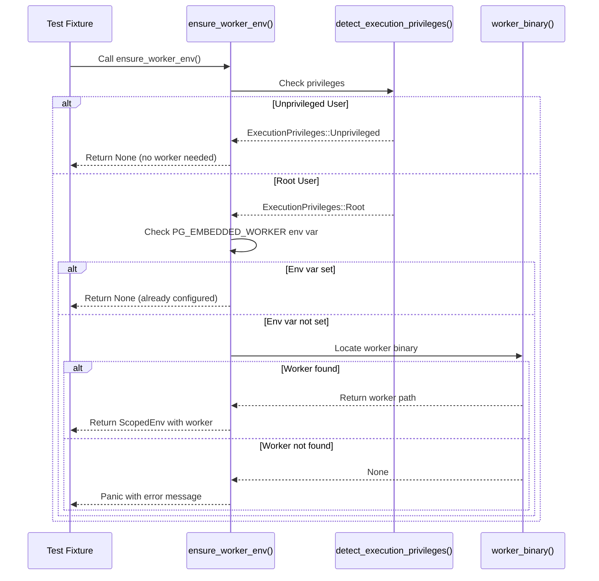

# Zero-config RAII Postgres test fixture design

To evolve **pg-embedded-setup-unpriv** into a seamless, zero-configuration
Resource Acquisition Is Initialization (RAII) test fixture, we will create a
high-level testing helper that automatically handles environment differences
(root vs non-root) and integrates with Rust test frameworks. The goal is for
developers to **write tests that spin up an embedded PostgreSQL instance with
no manual setup**, whether running as root (e.g. Codex sandbox) or as an
unprivileged user (e.g. GitHub CI), using the same code. Below we outline the
design steps and features:

## Automatic privilege detection (root vs. unprivileged)

We will make the fixture **auto-detect the execution context** and adjust
accordingly, so the developer “shouldn’t have to do anything” extra (see
docs/next-steps.md). This can be done at runtime by checking the effective user
ID:

### Implementation update (2024-05-09)

- Runtime detection now materializes as an `ExecutionPrivileges` enum. The enum
  communicates whether the bootstrapper must drop privileges or can proceed
  in-place, allowing call sites and behavioural tests to assert the chosen path
  without reimplementing the detection logic.

- Root execution uses `bootstrap_with_root`, a helper that prepares the
  installation and data directories for the `nobody` account and delegates
  lifecycle commands to the `pg_worker` subprocess. The helper deliberately
  re-applies ownership and permissions on every invocation, so two consecutive
  bootstraps remain idempotent without mutating the caller’s process identity.

- Unprivileged execution now exercises `bootstrap_unprivileged`, which sets up
  directories with the caller’s UID, clamps permissions to PostgreSQL-friendly
  defaults (0755 runtime, 0700 data), and reuses the same environment
  normalization as the root flow. This guarantees identical layout regardless
  of privileges.

- Behavioural tests implemented with `rstest-bdd` (Behaviour-Driven
  Development, BDD) cover both flows. The scenarios share a reusable sandbox
  that records the detected privileges, runs bootstrap as either root or
  `nobody`, and asserts ownership plus double-run idempotence for the
  privileged path.

- Filesystem work now routes through `cap-std` with `camino` path handling so
  bootstrap always honours capability-based sandboxing and fails fast when
  callers provide non UTF-8 directories.

- Behavioural tests wrap environment changes with the shared `with_scoped_env`
  helper. The helper guards `temp_env::with_vars` behind a process-wide mutex
  so concurrent scenarios cannot interleave global mutations, keeping runs
  isolated and aligned with the testing guidelines.

- The bootstrap orchestration now follows the flow illustrated below. The
  sequence diagram highlights the privilege detection and the branching between
  the root and unprivileged bootstrap paths, showing how the privileged route
  prepares directories for `nobody`, hands control to the worker subprocess,
  and performs the same environment normalisation as the in-process branch.


- **If running as root on Linux:** the helper prepares directories that are
  owned by the sandbox user (currently `"nobody"`) and delegates every
  privileged filesystem task to the `pg_worker` subprocess. The parent keeps
  its original UID and GID throughout; the worker assumes the sandbox
  credentials before touching the filesystem or launching PostgreSQL.

- **If running as a normal user or on non-Linux platforms:** no privilege
  dropping is needed. The helper will simply use the `postgresql_embedded`
  crate in its normal mode (which runs as the current user). On macOS/BSD, we
  treat the helper as a **no-op pass-through** to `postgresql_embedded`
  (privileged setup is only targeted on Linux) – meaning the library will just
  use the embedded Postgres defaults without special permission handling.

This runtime detection makes the behaviour “fixed per environment” but
**transparent to the developer** – your test code calls the same API in all
cases, and the library decides whether to invoke the privileged path or not.
(Compile-time detection is less practical for root vs non-root, so a runtime
check of UID is simplest and robust.)

## RAII `TestCluster` implementation

We will introduce a `TestCluster` RAII struct that encapsulates an embedded
Postgres instance’s lifecycle (see docs/next-steps.md). This struct will hide
all setup/teardown details:

- **On creation/start:** it configures and launches a PostgreSQL instance using
  `postgresql_embedded`. Root executions dispatch setup and start to the
  `pg_worker` helper, which runs with the sandbox credentials and touches the
  prepared directories on behalf of the parent. Unprivileged executions keep
  everything in-process. In both cases the cluster lifecycle still flows
  through the embedded crate’s `.setup()` and `.start()` routines.

- **On drop:** `TestCluster` will implement `Drop` to automatically **stop the
  database and clean up**. Upon going out of scope (e.g. end of a test), it
  will call `postgresql_embedded.stop()` to shut down the Postgres subprocess
  gracefully (see postgresql-embedded README). This ensures no orphan processes
  or locks remain, giving true RAII semantics.

- **Connection info and utilities:** `TestCluster` can hold the connection
  parameters (port, host, credentials) or even provide convenience methods. For
  example, we can include a method like `get_diesel_connection()` to quickly
  obtain a Diesel `PgConnection` to the test database, and perhaps methods to
  execute SQL or apply fixture scripts (see docs/next-steps.md). (While schema
  loading or SQL fixtures are a *“day 2”* feature, designing `TestCluster` with
  extension points for running setup SQL is wise for future needs.)

- **Zero configuration defaults:** To keep it zero-config, `TestCluster` will
  choose sensible defaults if the user doesn’t specify any. We’ll leverage
  `PgEnvCfg::load()` (from the existing OrthoConfig integration) to gather any
  env/file configs, but if none are provided, use
  `postgresql_embedded::Settings::default()` with smart tweaks (see
  docs/next-steps.md). This means using the latest PostgreSQL version by
  default, a random free port, and temporary directories for data. All of this
  happens behind the scenes, so in most cases **the developer simply creates a
  `TestCluster` with no arguments**.

## Bootstrapping and configuration handling

We will provide a high-level **`bootstrap_for_tests()` helper** as a one-call
setup for tests (see docs/next-steps.md). This function will:

- Load the configuration from environment or config files via `PgEnvCfg::load()`
  (using ortho_config), applying any overrides like `PG_VERSION_REQ`,
  `PG_PORT`, etc., but **the developer need not set anything** for defaults.

- Internally prepare the directories and configuration with the correct owner
  and permissions, then invoke either the in-process bootstrap or the
  subprocess-based worker. When root privileges are detected, the helper
  creates, chmods, and chowns the installation and data directories for
  `"nobody"`, writes the worker payload, and asks the worker to perform the
  remaining privileged calls. Unprivileged callers stay within the current
  process because no identity switch is necessary.

- Return the resulting configuration (e.g. a `PgSettings` or our own struct) and
  paths that were used (see docs/next-steps.md). This gives visibility into
  where the data directory and binaries are, and the connection info (like the
  chosen port).

### Implementation update (2024-05-24)

- `bootstrap_for_tests()` now returns `TestBootstrapSettings`, a struct that
  bundles the derived `postgresql_embedded::Settings`, the detected
  `ExecutionPrivileges`, and a `TestBootstrapEnvironment` describing the
  process variables needed by downstream clients.
- `TestBootstrapEnvironment::to_env()` exposes the prepared environment map, so
  callers can export `HOME`, `XDG_CACHE_HOME`, `XDG_RUNTIME_DIR`, `PGPASSFILE`,
  and `TZ` without reimplementing path logic. When a time zone database is
  discovered, the helper also emits `TZDIR`, honouring user-provided overrides
  and falling back to common Linux locations whilst surfacing a clear error
  when `tzdata` is missing.
- Behavioural tests implemented with `rstest-bdd` verify the happy path and the
  time zone error case. The scenarios assert that the returned settings target
  the sandboxed directories supplied via the environment and that the exported
  variables match the defaults recorded by the helper.

Example usage:

```rust
use pg_embedded_setup_unpriv::{bootstrap_for_tests, TestBootstrapSettings};
use pg_embedded_setup_unpriv::error::BootstrapResult;

fn bootstrap() -> BootstrapResult<TestBootstrapSettings> {
    let prepared = bootstrap_for_tests()?;
    for (key, value) in prepared.environment.to_env() {
        match value {
            Some(value) => std::env::set_var(&key, value),
            None => std::env::remove_var(&key),
        }
    }
    Ok(prepared)
}
```

### Implementation update (2025-11-24)

- Added `tracing` spans and logs (targeted under `pg_embed::observability`)
  around privilege drops, directory ownership/permission mutations, scoped
  environment application, and `postgresql_embedded` lifecycle transitions.
- Environment telemetry now emits `KEY=set` or `KEY=unset` markers rather than
  values to avoid leaking credentials while still showing which variables were
  injected or removed.
- Unit coverage exercises the new instrumentation for environment scoping and
  the test-only privilege-drop bypass, while `rstest-bdd` scenarios assert the
  presence of lifecycle, directory, and failure-context logs for both happy and
  unhappy bootstrap paths.

### Implementation update (2025-11-25)

- Scoped environment logging now truncates the rendered key summary to a
  bounded length while always recording the change count, keeping observability
  output readable when large snapshots are applied.
- Lifecycle failures emit at `error` level and carry span context; worker spawn
errors preserve the original `io::Error` chain, so callers can downcast or map
errno precisely.
- Filesystem helpers inline their logging and error handling to retain
  observability without the previous helper indirection, simplifying the
  privilege setup flow.
- Tree ownership fixes run inside a single traversal loop, maintaining the
  updated-entry count without the separate walker type.
- Observability behavioural scenarios now assert lifecycle span presence and
  failure logs, and a focused unit test ensures span enter/close events are
  captured by the logging harness used in BDD suites.

### Implementation update (2024-06-10)

- Implemented the `TestCluster` RAII guard. `TestCluster::new()` reuses
  `bootstrap_for_tests()` to prepare settings, applies a shared `ScopedEnv`
  guard that keeps the bootstrap environment active for the duration of the
  cluster, and starts PostgreSQL on a dedicated current-thread Tokio runtime.
- Added integration and unit coverage that proves the guard stops PostgreSQL on
  drop by asserting that `postmaster.pid` disappears and that the environment
  is restored to its pre-cluster snapshot. Behavioural tests exercise both the
  happy path and the time zone failure case.

### Implementation update (2024-06-24)

- Consolidated environment scoping through the library's `ScopedEnv` guard, so
  integration helpers reuse the same mutex and restoration semantics. This
  removes the bespoke test guard that risked diverging behaviour or deadlocks
  when combined with library code.

In practice, **`TestCluster::start()` can wrap `bootstrap_for_tests()`**
internally. For example, `TestCluster::start()` would call
`bootstrap_for_tests()` to do all the configuration and initialization work,
then launch the Postgres server process and yield a `TestCluster` instance that
holds the running server. The idea is to encapsulate all “boilerplate” (time
zone env, password file handling, etc.) so that tests do not repeat those steps
(see docs/next-steps.md). This makes starting a test database **trivial** –
essentially one line in the test setup.

### Implementation update (2025-11-06)

- Added `TestCluster::connection()`, which exposes a lightweight
  `TestClusterConnection` helper for querying host, port, credentials, and the
  generated `.pgpass` file without cloning the underlying bootstrap struct.
  `ConnectionMetadata` captures an owned snapshot, so callers can persist the
  values beyond the guard's lifetime.
- Introduced the opt-in `diesel-support` Cargo feature. When enabled, the new
  helper exposes `diesel_connection()` for establishing a
  `diesel::PgConnection` with a single call. The helper preserves the crate's
  default of keeping Diesel optional for consumers that do not need it, while
  the project's `make test` target exercises the code path via `--all-features`.
- Augmented the behavioural suite with `rstest-bdd` scenarios that execute
  real SQL against the embedded instance. One scenario issues `SELECT 42` and
  proves the helper returns live data, while the unhappy-path scenario drives a
  malformed query and asserts that Diesel's descriptive error bubbles up
  through the helper.
- Added focused unit tests around the new metadata struct, so regressions in
  URL rendering or `.pgpass` propagation surface without needing to boot
  PostgreSQL.

### Implementation update (2025-11-15)

- Adopted the general-availability `rstest-bdd` 0.3.2 release (and the matching
  macro crate) so behavioural coverage for privilege detection and Diesel flows
  uses the currently supported API line and aligns with `Cargo.toml`.
- Confirmed that the Fluent-backed localization layer and i18n dependencies
  continue to load lazily through `rust-embed`, keeping the fixture's hot path
  unchanged while preserving multi-locale reporting across the BDD suite.
- Recorded this dependency uplift to keep the design doc aligned with the tool
  chain choices and to signpost downstream crates that they can rely on the
  0.3.2 APIs when authoring scenarios.
- Added a Dutch `rstest-bdd` scenario (`tests/localized_diagnostics.rs`) that
  switches diagnostics to French via `select_localizations`. The test is part
  of `make test`, giving CI a deterministic signal that localization bundles
  ship correctly on every target platform.

### Implementation update (2025-12-02)

- Bootstrap now emits a debug-level, sanitized snapshot of the chosen
  `postgresql_embedded::Settings`, covering the version requirement, host,
  port, and the installation, data, and `.pgpass` directories. Secrets are
  always redacted: passwords log as `<redacted>` and configuration values are
  reduced to their keys.
- A focused unit test exercises the sanitized renderer, asserting that ports and
  directories appear while the password never does.
- Behavioural coverage driven by `rstest-bdd` asserts that the settings summary
  is present for both successful and failing bootstraps and that sensitive
  values remain redacted even when preparation errors occur.

#### Class diagram (2025-12-10)

The worker payload and snapshot types are organized as follows.



*Figure: Worker payload serialisation and redaction flow.*

### Implementation update (2026-01-12)

- Introduced the optional `loom` dependency and `loom-tests` feature; runtime
  code keeps `ENV_LOCK` as a `std::sync::Mutex`, while Loom tests use a
  Loom-specific lock and thread state via a private state accessor hook.
- Added Loom-backed concurrency tests for `ScopedEnv` under `loom-tests`; the
  Loom tests are marked `#[ignore]` so `make test` does not run the
  model-checking suite.
- Documented the Loom test command in the developer guide; there are no
  user-facing behaviour changes.
- Behavioural tests (rstest-bdd) are not applicable because this change only
  affects internal test instrumentation rather than observable runtime
  behaviour.
- Refactored `ScopedEnv` and `ThreadState` into generic cores parameterized by
  pluggable lock and thread-state backends. The `EnvLockOps` trait abstracts
  mutex operations, while `ThreadStateCore<L>` is a generic type parameterized
  by the lock backend. Production builds use `StdEnvLock` (wrapping
  `std::sync::Mutex`), while Loom tests supply `LoomEnvLock` (wrapping
  `loom::sync::Mutex`). This enables swapping synchronization implementations
  for model checking without altering runtime code paths.

### Implementation update (2026-01-15): Async API

- Added `TestCluster::start_async()` and `stop_async()` methods, feature-gated
  behind the `async-api` Cargo feature. These methods allow `TestCluster` to be
  used within async contexts like `#[tokio::test]` without the "Cannot start a
  runtime from within a runtime" panic.

- The `runtime` field in `TestCluster` is now `Option<Runtime>`. When `None`,
  the cluster was created via `start_async()` and runs on the caller's runtime.
  When `Some(_)`, the cluster owns its runtime (synchronous mode). An
  `is_async_mode: bool` field tracks the mode explicitly.

- Created `AsyncInvoker` as a separate struct from `WorkerInvoker`. The existing
  `WorkerInvoker` holds `&'a Runtime` for `block_on()` calls, which is not
  available in async mode. `AsyncInvoker` directly `.await`s futures for
  unprivileged operations and uses `spawn_blocking` for root operations that
  require subprocess spawning.

- The `Drop` implementation handles async-created clusters via best-effort
  cleanup. It uses `tokio::runtime::Handle::try_current()` to detect if an async
  runtime is available, spawns a cleanup task if so, and logs a warning advising
  users to call `stop_async()` explicitly. This avoids panicking in `Drop` while
  still attempting resource cleanup.

- Design decision: `Option<Runtime>` was chosen over a dedicated enum because
  it's the simplest representation—`None` means async mode, `Some(_)` means
  sync mode—and avoids complexity of enum matching throughout the codebase.

- Design decision: `start_async()` was named to match the design document
  proposal and be action-oriented, clearly indicating that the cluster starts
  rather than just being constructed.

- Design decision: The async API is feature-gated to allow sync-only consumers
  to avoid pulling in async code paths. The feature is opt-in since tokio is
  already a dependency, but the async methods add compilation overhead.

- Added comprehensive async tests in `tests/test_cluster_async.rs` with
  `#[file_serial(cluster)]` serialisation to prevent data directory conflicts
  with other cluster tests.

### Implementation update (2026-01-16): Privilege-aware worker requirement

- Fixed issue where `test_cluster` and `shared_test_cluster` fixtures
  unconditionally required the `pg_worker` binary, causing tests to fail for
  unprivileged users with "SKIP-TEST-CLUSTER: PG_EMBEDDED_WORKER is not set and
  pg_worker binary was not found".

- Root cause: The `ensure_worker_env()` function in `src/test_support/fixtures.rs`
  did not check execution privileges before requiring the worker binary. The
  correct logic already existed in `src/bootstrap/mode.rs`, where unprivileged
  execution runs in-process without a worker, while root execution requires the
  worker for privilege dropping.

- Fix: Modified `ensure_worker_env()` to call `detect_execution_privileges()`
  first and return `None` immediately for unprivileged users, bypassing the
  worker requirement entirely. Root users continue to require the worker binary
  (or `PG_EMBEDDED_WORKER` environment variable).

- This aligns test fixture behaviour with the existing privilege detection
  architecture, removing an unnecessary requirement for unprivileged scenarios
  whilst maintaining security for privileged execution.

The following sequence diagram describes the control flow for worker detection
and privilege handling.



*Figure: Control flow for privilege-aware worker binary requirement in test
fixtures. Unprivileged users bypass worker detection entirely, whilst root users
follow the existing worker location logic. See issue #52[^1].*

[^1]: <https://github.com/leynos/pg-embedded-setup-unpriv/issues/52>

### Ephemeral ports and isolation

To allow the same tests to run concurrently (especially under `nextest`, which
runs tests in parallel), our fixture should avoid fixed resources like static
ports. We will configure the cluster to use **ephemeral ports by default**,
unless a specific `PG_PORT` is given. The `postgresql_embedded` crate supports
running on ephemeral ports (see postgresql-embedded README), so by setting the
port to 0 in the settings (or leaving it unspecified and letting the crate
choose), each `TestCluster` will get a free port assigned at runtime. The
chosen port can be obtained from the returned settings or directly via the
`PostgreSQL` handle after startup.

Similarly, we should ensure each cluster uses a unique data directory (if not
explicitly configured). For example, we can generate a temp directory (in
`/var/tmp/pg-embed-<uid>/...` or using `tempfile::tempdir`) for each test
instance. The current default is to use `/var/tmp/pg-embed-<uid>/data` and
`.../install` for a given UID (see src/lib.rs) – we may tweak this so that if
multiple clusters are initialized in one run, they do not all target the exact
same path. One approach is to include a random suffix or use the OS tempdir for
isolation. This way, two tests running in parallel will not conflict over the
data directory or lock files. The **installation binaries cache** could still
be shared (so we do not re-download Postgres multiple times), but the database
**data directory will be distinct per cluster**.

## Integration with test frameworks (sync and async tests)

We will ensure the library works smoothly in both synchronous and asynchronous
Rust tests:

- **Synchronous tests (`cargo test`):** We can enable the
  `postgresql_embedded` crate’s `"blocking"` feature to use its blocking API
  (see postgresql-embedded README). This allows calling `PostgreSQL::setup()`
  and `start()` in a normal
  #[test] function without needing an async runtime. For example,
  `TestCluster::start()` can internally call the blocking setup/start and
  return once the DB is running. Developers can then use Diesel or any blocking
  client directly.

- **Asynchronous tests (tokio):** The `async-api` feature (added 2026-01-15)
  provides `TestCluster::start_async()` and `stop_async()` for use in async
  contexts like `#[tokio::test]`. These methods run PostgreSQL lifecycle
  operations on the caller's runtime rather than creating a separate one,
  avoiding the "Cannot start a runtime from within a runtime" panic. Users must
  call `stop_async()` explicitly before the cluster goes out of scope, since
  `Drop` cannot be async. See the implementation update above for design details.

- **Uniform API:** The same `TestCluster` type works for both sync and async
  tests. Calling `new()` in a sync test performs blocking startup using an
  internal Tokio runtime, whilst calling `start_async()` in an async test awaits
  the lifecycle operations on the caller's runtime. Both paths share the same
  bootstrap logic and produce identical cluster configurations. For example:

```rust
// Synchronous test
#[test]
fn test_something() {
    let cluster = TestCluster::new().expect("PG start failed");
    // ... use cluster (Diesel, etc.)
}

// Asynchronous test (requires `async-api` feature)
#[tokio::test]
async fn test_async_thing() {
    let cluster = TestCluster::start_async().await.expect("PG start failed");
    // ... use cluster with async client
    cluster.stop_async().await.expect("PG stop failed");
}
```

Under the hood, both paths configure and launch Postgres appropriately,
delegating to the worker helper when root privileges are detected so lifecycle
commands run as `nobody`.

- **rstest fixtures:** The crate now ships a built-in `rstest` fixture exposed
  as `pg_embedded_setup_unpriv::test_support::test_cluster`. When imported into
  a test module, any `#[rstest]` function that declares a
  `test_cluster: TestCluster` parameter receives a ready instance without
  invoking `TestCluster::start()` manually. The fixture is validated by the
  `tests/test_cluster_fixture.rs` suite, which combines direct `#[rstest]`
  tests with `rstest-bdd` (v0.3.2) scenarios that cover both successful
  bootstraps and timezone failures. The fixture panics with a
  `SKIP-TEST-CLUSTER` prefix, so behavioural tests can convert known external
  issues into soft skips.

```rust
#[fixture]
pub fn test_cluster() -> TestCluster {
    TestCluster::new().unwrap()
}
```

This allows tests to declare `fn my_test(test_cluster: TestCluster) { ... }`
and get a running DB instance injected automatically. This keeps integration
tests concise and consistent across projects, with unified behaviour for both
root and unprivileged execution paths.

- **Parallel test runners:** Using `cargo nextest` (or even running
  `cargo test -- --test-threads=n`), multiple tests may run concurrently. We
  have addressed this by using ephemeral ports and separate data directories as
  noted. We will also implement any necessary synchronization to avoid race
  conditions on initial download (for example, one test could call
  `ensure_pg_binaries_cached()` at the start of the suite – see below). With
  these measures, our fixture will be **nextest-ready**, and tests can run in
  parallel without interfering with each other.

## Caching and CI-friendly features

To optimize performance and reliability in CI or rapid local testing, we will
add a couple of helper functions:

- **Binary Cache Preloading:** Provide an `ensure_pg_binaries_cached()`
  function (see docs/next-steps.md) that pre-fetches the PostgreSQL binaries
  archive (using the configured version). This would essentially invoke the
  download logic of `postgresql_embedded` ahead of time. In a busy CI
  environment, this avoids each test run (or each parallel test) hitting the
  GitHub releases API and potentially running into rate limits. We can make
  this function automatically use a `GITHUB_TOKEN` from the environment to
  authenticate and increase rate limits during the download (see
  docs/next-steps.md). Developers could call this in a `build.rs` or a test
  setup hook (or we might integrate it into `bootstrap_for_tests` to run once).
  After caching, all test clusters can reuse the local archive, resulting in
  faster startup and a *flakeless* experience even with many tests.

- **Prerequisite checks (tzdata, etc.):** The helper will detect common
  environment issues and either fix or emit clear errors (see
  docs/next-steps.md). A primary example is the time zone data requirement – if
  the host is missing the `tzdata` package, PostgreSQL may fail to start with a
  time zone error (see README.md). We can proactively check for the presence of
  the system time zone database (e.g. check if `/usr/share/zoneinfo` exists)
  and **guide the user to install it** if not. For instance, if not found, we
  can return an error like *“Time zone database not found (tzdata missing).
  Please install tzdata (e.g. `apt-get install tzdata`) on this system.” (see
  docs/next-steps.md). Similar checks could be done for other prerequisites
  (though tzdata is the main one encountered). By doing this, we prevent
  puzzling failures and make the developer experience smoother.

- **Environment setup (TZDIR, etc.):** The library can also set up any required
  environment variables automatically. For example, if we need to set `TZDIR`
  or `TZ` environment for the embedded Postgres to find time zone info, or
  `PGPASSFILE` for the generated password file, the `bootstrap_for_tests()`
  should handle that internally (see docs/next-steps.md). This encapsulates all
  those nitty-gritty details so tests don’t need to worry about them.

## Logging and visibility

For a pleasant developer experience, we will add **logging instrumentation** to
the helper’s operations (see docs/next-steps.md). Using the `tracing` crate, we
can emit debug/info logs for steps like:

- Delegating privileged filesystem work (e.g. “Invoking pg_worker as nobody for
  setup”).

- Directory creation and ownership changes (e.g. “Chowning
  /var/tmp/pg-embed-1000 to user nobody”).

- Setting environment variables (like informing if we override `HOME`,
  `XDG_CACHE_HOME`, `PGPASSFILE` paths for the embedded process).

- Postgres startup events (downloading binaries, starting server on port XYZ,
  etc.).

These logs (visible when tests are run with `RUST_LOG` configured) will help
troubleshoot any issues in the setup process without the developer having to
guess what the helper is doing (see docs/next-steps.md). By surfacing directory
paths and config values in logs, users can verify that the auto-detection
picked up the right settings (for example, confirming it used an ephemeral port
or the expected PG version).

## Platform support and limitations

Initially, our focus is **Linux** for the worker-mediated privileged flow. On
Linux, running tests as root will trigger the privileged path, provisioning
directories for `nobody` and delegating to the subprocess so PostgreSQL is
initialised without ever changing the parent’s identity. On other Unix-like
OSes (macOS, FreeBSD), we do not attempt any worker delegation because tests
usually run as an unprivileged user. If someone does run as root on macOS, we
either error out or treat the execution as unprivileged. The embedded Postgres
crate itself supports Mac/Windows, but those environments rely on the normal
in-process bootstrap – effectively the fixture calls `PostgreSQL::setup()` and
`start()` directly on those platforms.

We are **leveraging the `postgresql-embedded` crate** as the core engine for
cross-platform support (see postgresql-embedded README), so all OS-specific
nuances of downloading and running PostgreSQL are handled by that library. Our
layer is an orchestration on top to handle permission and configuration in a
test-friendly way. This means as `postgresql-embedded` gains features or
support, our fixture inherits them. (For example, Windows support is
out-of-scope for now, but could be considered in the future through that crate.)

## Summary: developer experience

Once these improvements are in place, using the library in tests will be
extremely easy and consistent:

- **No manual setup:** The test writer does not need to manually create users,
  directories, or call out to `sudo` scripts. Just calling our fixture is
  enough to get a working empty PostgreSQL instance.

- **Same code runs anywhere:** The *same test code* runs on a root CI (where we
  chown directories and delegate privileged work to the worker subprocess) and
  on an unprivileged machine (where everything stays in-process). There’s no
  need for conditional logic in the test depending on environment – the library
  handles it.

- **Integration with frameworks:** Using the provided rstest fixture or similar,
  tests can be written in a clean style without repetitive setup/teardown code.
  For example, a test function can simply accept a `test_cluster: TestCluster`
  parameter (see docs/next-steps.md) and immediately proceed to execute queries
  against the database, relying on RAII for cleanup.

- **Defaults with escape hatches:** By default, everything is auto-chosen
  (ports, temp dirs, latest PG version). If needed, developers can still
  override via env vars or config files (`pg.toml`, etc.) using the OrthoConfig
  system (see README.md), but this is purely optional. In most cases “it just
  works” with zero config.

In conclusion, **pg-embedded-setup-unpriv** will evolve from a low-level
bootstrap tool into a robust test fixture foundation. By combining automatic
root handling, an RAII `TestCluster` struct, and helper utilities (for caching
and prerequisites), we provide a **smooth, seamless developer experience** for
Postgres integration testing. Developers can write tests once and run them
anywhere with confidence that the embedded database will spin up and tear down
correctly, whether under root in a container or as a normal user on a laptop.
These changes align with the planned ergonomic improvements (see
docs/next-steps.md) and will make PostgreSQL integration tests in Rust as
effortless as using an in-memory database, but with full PostgreSQL fidelity.

**Sources:**

- pg_embedded_setup_unpriv – *Next Steps for Root-Oriented Postgres
  Testing* (see docs/next-steps.md) (design goals for fixtures, RAII cluster,
  caching, etc.)

- pg_embedded_setup_unpriv – *README (Usage and
  prerequisites)* (see README.md) (need for root and tzdata for embedded
  Postgres)

- theseus-rs/postgresql_embedded – *README (features and
  examples)* (see postgresql-embedded README) (capabilities of the underlying
  embedded Postgres crate, async vs blocking API, ephemeral ports support)
